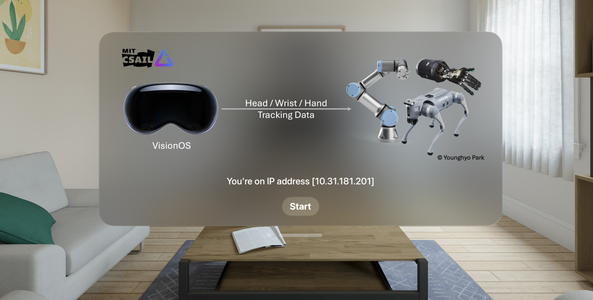
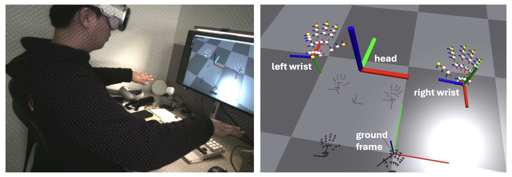
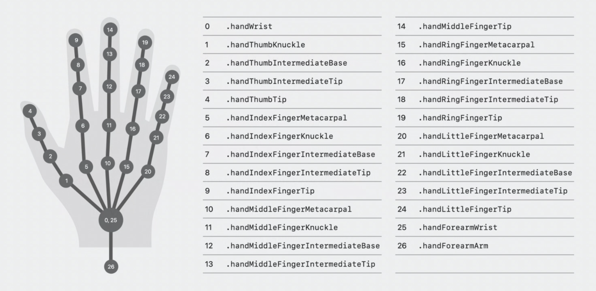

VisionProTeleop
===========


Wanna use your new Apple Vision Pro to control your robot?  Wanna record how you navigate and manipulate the world to train your robot? 
This VisionOS app and python library streams your Head + Wrist + Hand Tracking result via gRPC over a WiFi network, so any robots connected to the same wifi network can subscribe and use. 

> **For a more detailed explanation, check out this short [paper](./assets/short_paper_new.pdf).**


## How to Use

If you use this repository in your work, consider citing:

    @software{park2024avp,
        title={Using Apple Vision Pro to Train and Control Robots},
        author={Park, Younghyo and Agrawal, Pulkit},
        year={2024},
        url = {https://github.com/Improbable-AI/VisionProTeleop},
    }

### Step 1. Install the app on Vision Pro 



This app is now officially on VisionOS App Store! You can search for **[Tracking Streamer](https://apps.apple.com/us/app/tracking-streamer/id6478969032)** from the App Store and install the app. 

If you want to play around with the app, you can build/install the app yourself too. To learn how to do that, take a look at this [documentation](/how_to_install.md). This requires (a) Apple Developer Account, (b) Vision Pro Developer Strap, and (c) a Mac with Xcode installed. 


### Step 2. Run the app on Vision Pro 

After installation, click on the app on Vision Pro and click `Start`. That's it!  Vision Pro is now streaming the tracking data over your wifi network. 

**Tip**  Remember the IP address before you click start; you need to specify this IP address to subscribe to the data. Once you click start, the app will immediately enter into pass-through mode. Click on the digital crown to stop streaming.  


### Step 3. Receive the stream from anywhere

The following python package allows you to receive the data stream from any device that's connected to the same WiFi network. First, install the package: 

```
pip install avp_stream
```

Then, add this code snippet to any of your projects you were developing: 

```python
from avp_stream import VisionProStreamer
avp_ip = "10.31.181.201"   # example IP 
s = VisionProStreamer(ip = avp_ip, record = True)

while True:
    r = s.latest
    print(r['head'], r['right_wrist'], r['right_fingers'])
```


## Available Data

```python
r = s.latest
```

`r` is a dictionary containing the following data streamed from AVP: 

```python
r['head']: np.ndarray  
  # shape (1,4,4) / measured from ground frame
r['right_wrist']: np.ndarray 
  # shape (1,4,4) / measured from ground frame
r['left_wrist']: np.ndarray 
  # shape (1,4,4) / measured from ground frame
r['right_fingers']: np.ndarray 
  # shape (25,4,4) / measured from right wrist frame 
r['left_fingers']: np.ndarray 
  # shape (25,4,4) / measured from left wrist frame 
r['right_pinch_distance']: float  
  # distance between right index tip and thumb tip 
r['left_pinch_distance']: float  
  # distance between left index tip and thumb tip 
r['right_wrist_roll']: float 
  # rotation angle of your right wrist around your arm axis
r['left_wrist_roll']: float 
 # rotation angle of your left wrist around your arm axis
```


### Axis Convention

Refer to the image below to see how the axis are defined for your head, wrist, and fingers. 




### Hand Skeleton used in VisionOS



Refer to the image above to see what order the joints are represented in each hand's skeleton. 


## Acknowledgements 

We acknowledge support from Hyundai Motor Company and ARO MURI grant number W911NF-23-1-0277. 

<!-- Misc 

If you want to modify the message type, feel free to modify the `.proto` file. You can recompile the gRPC proto file as follows: 

#### for Python

```bash
python -m grpc_tools.protoc -I. --python_out=. --grpc_python_out=. handtracking.proto
```


#### for Swift
```bash
protoc handtracking.proto --swift_out=. --grpc-swift_out=.
```
After you recompile it, make sure you add it to the Xcode so the app can use the latest version of the swift_proto file.  -->
