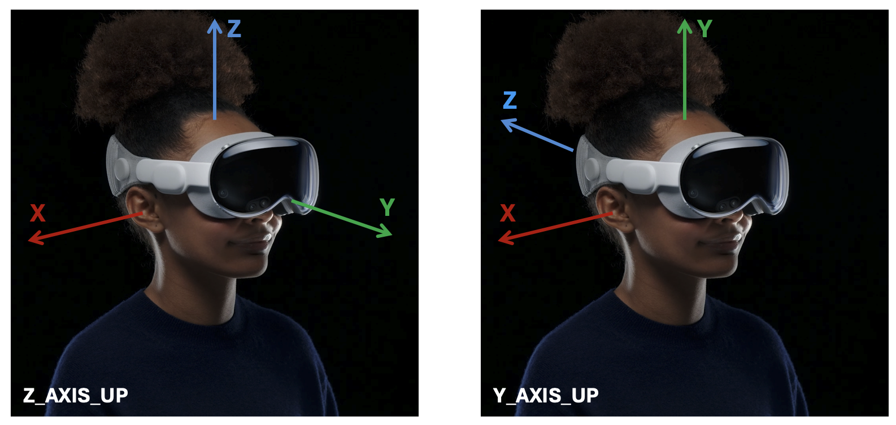

VisionProTeleop
===========


Wanna use your new Apple Vision Pro to control your robot?  Wanna record how you navigate and manipulate the world to train your robot? This app records / streams your (a) Wrist + Hand Tracking, and (b) Head Tracking result via gRPC over network, so any machines can subscribe and use. 


## How to Use


### Run the app on Vision Pro 


Click on the installed app on Vision Pro and click `Start`. That's it!  Vision Pro is now streaming the tracking data over local network. To learn how to install this app on your own Vision Pro, take a look at this [documentation](/how_to_install.md). 

**Tip**  Remember the IP address before you click start; you need to specify this IP address to subscribe to the data. Once you click start, the app will immediately enter into pass-through mode. Click on the digital crown to stop streaming.  


### Subscribe the data from anywhere

You can `git clone` this repository and install the python pacakge: 

```
pip install -e . -v
```

Then, add this code snippet to any of your projects you were developing: 

```python
from avp_stream import VisionProStreamer
s = VisionProStreamer(ip = avp_ip, record = True, up_axis = 'Z')

while True:
    latest = s.latest
    print(latest['head'], latest['right_wrist'], latest['right_fingers'])
```


## Data Type 

The `HandUpdate` structure contains (1) wristMatrix and (2) skeleton containing spatial poses of 24 hand joints.  

```yaml
HandUpdate
├── Head: Matrix4x4   # from global frame (1, 4, 4)
├── left_hand: Hand   
│   ├── wristMatrix: Matrix4x4   # from glboal frame (1, 4, 4)
│   └── skeleton: Skeleton
│       └── jointMatrices: Matrix4x4[]   # from wrist frame  (1, 4, 4)
└── right_hand: Hand
    ├── wristMatrix: Matrix4x4  # from global frame  (25, 4, 4)
    └── skeleton: Skeleton
        └── jointMatrices: Matrix4x4[]   # from wrist frame  (25, 4, 4)
```


### Axis Convention



You can specify the axis convention you want to use by specifying the `up_axis`. 

### Hand Skeleton used in VisionOS


Refer to the image above to see what order the joints are represented in each hand's skeleton. 


## Misc 

If you want to modify the message type, feel free to modify the `.proto` file. You can recompile the gRPC proto file as follows: 

#### for Python

```bash
python -m grpc_tools.protoc -I. --python_out=. --grpc_python_out=. handtracking.proto
```


#### for Swift
```bash
protoc handtracking.proto --swift_out=. --grpc-swift_out=.
```
After you recompile it, make sure you add it to the Xcode so the app can use the latest version of the swift_proto file. 