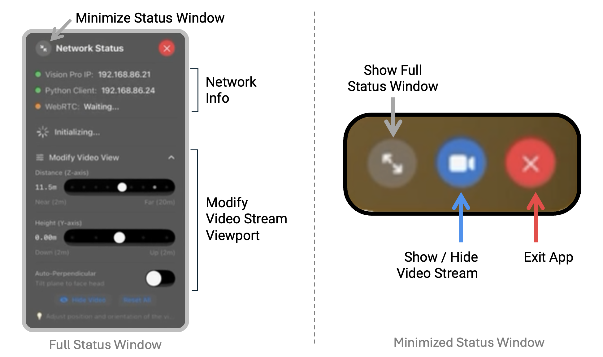

VisionProTeleop
===========


> **🎉 UPDATE: Now supporting Low-Latency Video Streaming!** You can now stream back your robot's video/audio feed back to Vision Pro via webRTC protocol, alongside the original hand tracking data stream. No complicated network setting required.  Update the app, `pip install --upgrade avp_stream`, and you're done!


<div align="center">
  
</div>
<p align="center">
  <a href="https://pypi.org/project/avp_stream/">
    
  </a>
  <a href="https://pypi.org/project/avp_stream/">
    
  </a>  
  <a href="https://opensource.org/licenses/MIT">
    
  </a>
</p>


This VisionOS app and python library streams your Head + Wrist + Hand Tracking result via gRPC over a WiFi network, so any robots connected to the same wifi network can subscribe and use. **It can also stream stereo (or mono) video / audio feeds from your robot, back to the Vision Pro.**

> **For a more detailed explanation, check out this short [paper](./assets/short_paper_new.pdf).*


## Latency Benchmark Results

We performed comprehensive round-trip latency measurements to benchmark our video streaming system. The measurement captures the full cycle: 
1. Python encodes a timestamp into a video frame as a marker
2. WebRTC transmission happens over the network
3. Vision Pro decodes the image, and reads the marekr
4. sends timing data back via gRPC 
5. Python calculates latency. 

This provides a conservative upper bound on user-experienced latency. According to our own testing, the system can consistently hit under 100ms both in wired mode and wireless mode for resolution under 720p. When wired up (requires developer strap), you can get stable 50ms latency even for **stereo 4K streaming**. 

For detailed methodology, test configurations, and complete results, see the **[Benchmark Documentation](docs/benchmark.md)**.


## How to Use

If you use this repository in your work, consider citing:

    @software{park2024avp,
        title={Using Apple Vision Pro to Train and Control Robots},`
        author={Park, Younghyo and Agrawal, Pulkit},
        year={2024},
        url = {https://github.com/Improbable-AI/VisionProTeleop},
    }

### Step 1. Install the app on Vision Pro 


This app is officially on VisionOS App Store! You can search for **[Tracking Streamer](https://apps.apple.com/us/app/tracking-streamer/id6478969032)** from the App Store and install the app. 


> If you want to play around with the app, you can build/install the app yourself too. To learn how to do that, take a look at this [documentation](/how_to_install.md). This requires (a) Apple Developer Account, (b) Vision Pro Developer Strap, and (c) a Mac with Xcode installed. 


### Step 2. Run the app on Vision Pro 

After installation, click and open the app on Vision Pro. It should show something like this. Click **START with Video Streaming** if you want to stream back videos from your robot over webRTC. Otherwise, click the left button. That's it!  

Vision Pro is now streaming the tracking data over your wifi network via gRPC, and ready to receive video stream via webRTC. 


### Step 3. Receive the hand tracking data from anywhere

The following python package allows you to receive the data stream from any device that's connected to the same WiFi network. First, install the package: 

```
pip install --upgrade avp_stream 
```

Then, add this code snippet to any of your projects you were developing: 

```python
from avp_stream import VisionProStreamer
avp_ip = "10.31.181.201"   # example IP 
s = VisionProStreamer(ip = avp_ip)

while True:
    r = s.latest
    print(r['head'], r['right_wrist'], r['right_fingers'])
```

### Step 4. [🎉V2 Update🎉] Stream video feeds back to Vision Pro! 

Streaming your robot's video feed back to Vision Pro requires one additional line: `start_streaming`. This feature is only supported on the latest version of the VisionOS app, and python package. Make sure you upgrade both python library / visionOS app. 

```python
from avp_stream import VisionProStreamer
avp_ip = "10.31.181.201"   # example IP 
s = VisionProStreamer(ip = avp_ip)

# you can simply start a video stream 
# by defining which video device you want to use
s.start_streaming(device="/dev/video0", format="v4l2", \
                        size="640x480", fps=30, stereo_video=False)

while True:
    r = s.latest
    print(r['head'], r['right_wrist'], r['right_fingers'])
```

You can also: 

- image-process the camera frames before you send it to Vision Pro 
  ```python
  s = VisionProStreamer(ip = avp_ip)
  # define your own image processing function, and register
  s.register_frame_callback(my_own_processor)
  s.start_streaming(device="/dev/video0", format="v4l2", \
                        size="640x480", fps=30)
  ```

- send over as a stereo camera feed   (assumes side-by-side concatenated image)

  ```python
  s = VisionProStreamer(ip = avp_ip)
  s.start_streaming(device="/dev/video0", format="v4l2", \
                        size="640x480", fps=30, stereo_video=True)
  ```

- work without a physical camera and send over synthetically generated frames (i.e., simulation renderings, or purely synthetic images)
  ```python
  s = VisionProStreamer(ip = avp_ip)
  # define your own image generating function, and register
  s.register_frame_callback(synthetic_frame_generator)
  s.start_streaming(size="1280x720", fps=60)
  ```

which is explained in detail in [examples](examples) folder. 

**Note:** Finding the right combination of `device`, `format`, `size`, and `fps` can sometime be tricky, since camera models only support certain combination. Also, depending on your operation system and how you plugged the camera, the camera might have been mounted on a different directory. To find the right combination of these parameters, you can use the following script: 

```bash
python test_video_devices.py --live
```
When it's the right combination, it'll show up a live feed of the selected camera. 


## Available Data

```python
r = s.latest
```

`r` is a dictionary containing the following data streamed from AVP: 

```python
r['head']: np.ndarray  
  # shape (1,4,4) / measured from ground frame
r['right_wrist']: np.ndarray 
  # shape (1,4,4) / measured from ground frame
r['left_wrist']: np.ndarray 
  # shape (1,4,4) / measured from ground frame
r['right_fingers']: np.ndarray 
  # shape (25,4,4) / measured from right wrist frame 
r['left_fingers']: np.ndarray 
  # shape (25,4,4) / measured from left wrist frame 
r['right_pinch_distance']: float  
  # distance between right index tip and thumb tip 
r['left_pinch_distance']: float  
  # distance between left index tip and thumb tip 
r['right_wrist_roll']: float 
  # rotation angle of your right wrist around your arm axis
r['left_wrist_roll']: float 
 # rotation angle of your left wrist around your arm axis
```


### Axis Convention

Refer to the image below to see how the axis are defined for your head, wrist, and fingers. 


### Hand Skeleton used in VisionOS


Refer to the image above to see what order the joints are represented in each hand's skeleton. 


## App Features


Status window is a good way to monitor the networking status, and control the life cycle of the app. It is shown in full view when you first start the app, but automatically gets minimized when video frame comes in. You can also minimize / maximize as you need. 



You can also modify the video viewport -- where and how the streamed video is presented in your AR environment. 


## Acknowledgements 

We acknowledge support from Hyundai Motor Company and ARO MURI grant number W911NF-23-1-0277. 

[](https://www.star-history.com/#improbable-ai/visionproteleop&type=date&legend=top-left)
