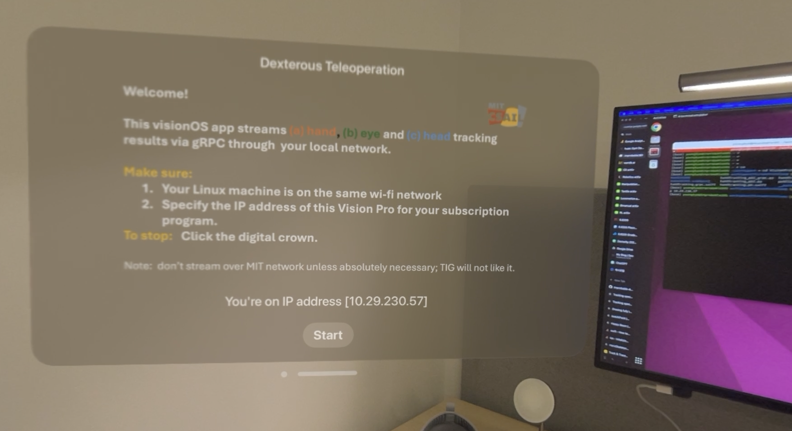

VisionProTeleop
===========



Wanna use your new Apple Vision Pro to control your robot?  Wanna record your manipulation demos? 

This app streams your 

1. Hand (Wrist + Finger) Tracking
2. Eye Tracking
3. Head Tracking 

data via gRPC over local network, so any machines can subscribe and use. 

## Data Type 

The `HandUpdate` structure contains (1) wristMatrix and (2) skeleton containing spatial poses of 24 hand joints.  

```yaml

HandUpdate
├── left_hand: Hand
│   ├── wristMatrix: Matrix4x4
│   └── skeleton: Skeleton
│       └── jointMatrices: Matrix4x4[]
└── right_hand: Hand
    ├── wristMatrix: Matrix4x4
    └── skeleton: Skeleton
        └── jointMatrices: Matrix4x4[]
```

where individual values of `Matrix4x4` can be accessed like: 

```
Matrix4x4
┌─────┬─────┬─────┬─────┐
│ m00 │ m01 │ m02 │ m03 │
├─────┼─────┼─────┼─────┤
│ m10 │ m11 │ m12 │ m13 │
├─────┼─────┼─────┼─────┤
│ m20 │ m21 │ m22 │ m23 │
├─────┼─────┼─────┼─────┤
│ m30 │ m31 │ m32 │ m33 │
└─────┴─────┴─────┴─────┘
```


## Usage

### Vision Pro (Publisher)

Click on DexTeleop app and click `Start`. Remember the IP address you're seeing before you click start -- you might need it to subscribe the streaming data. 

Click on the digital crown to stop streaming. 

### Python (Subscriber)

Execute below on any machine attached to the same network. 

```bash
python subscriber.py --vision-pro-ip 10.29.230.57
```

Note that you should change `--vision-pro-ip` . You can check the IP address of yours by going to "settings". 

**Disclaimer:**  Maybe don't use it over MIT network unless absolutely necessary -- TIG might not like it ... Try to use it in your own local network. 


## Recompiling Proto

In any case you want to recompile your `.proto` file, this is how you do it. 

### for Python

```bash
python -m grpc_tools.protoc -I. --python_out=. --grpc_python_out=. handtracking.proto
```


### for Swift
```bash
protoc handtracking.proto --swift_out=. --grpc-swift_out=.
```