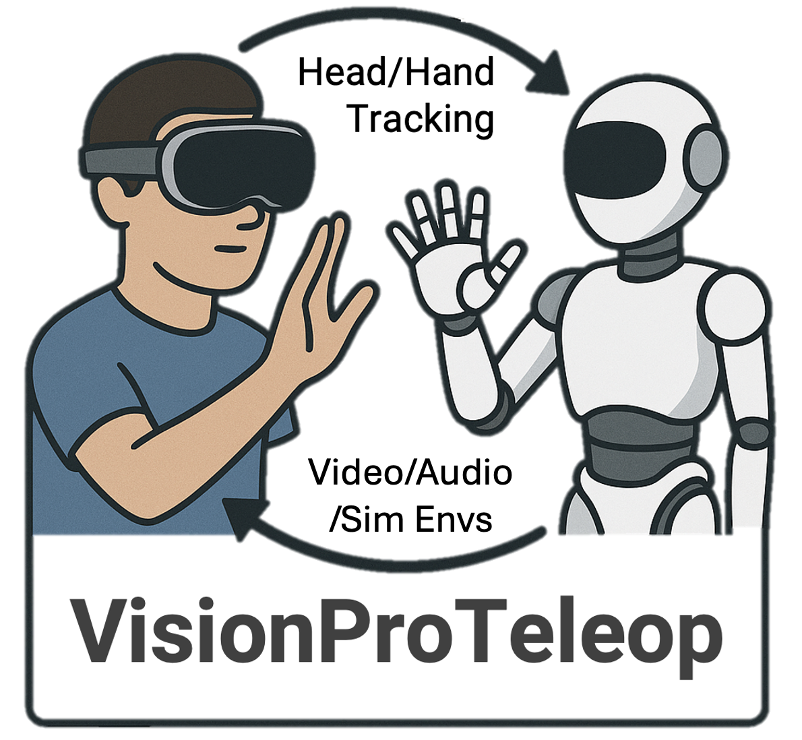
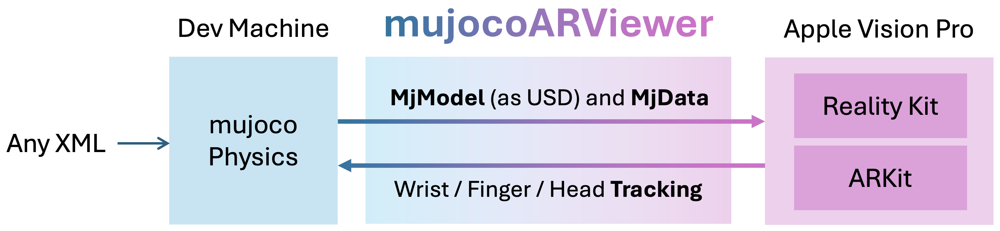
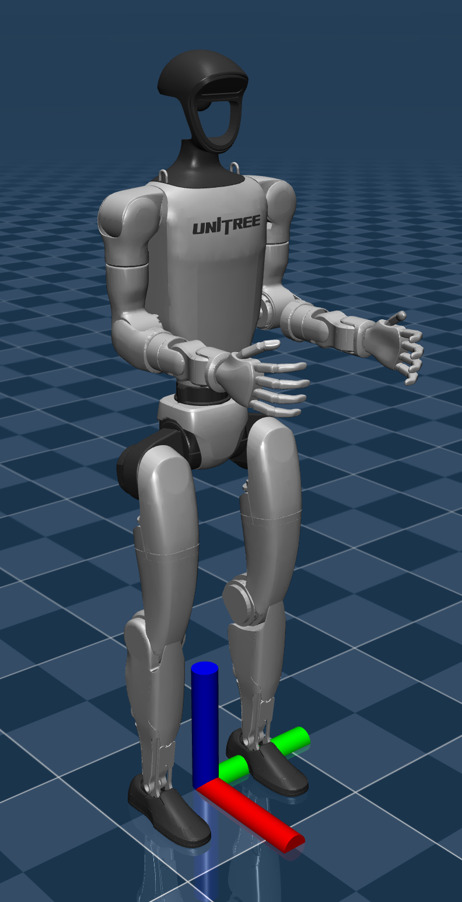
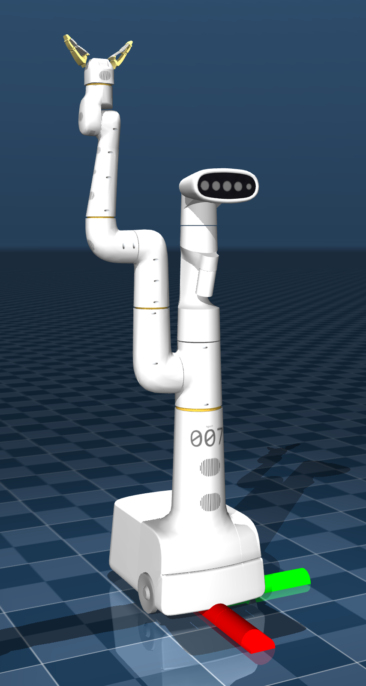
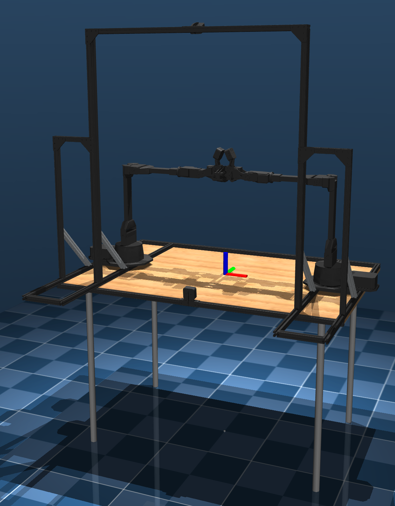
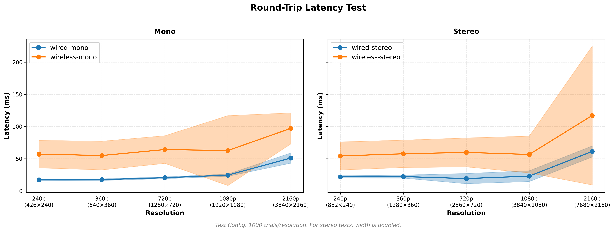

<!-- omit in toc -->
VisionProTeleop
===========

<div align="center">
  
</div>
<p align="center">
  <a href="https://pypi.org/project/avp_stream/">
    
  </a>
  <a href="https://pypi.org/project/avp_stream/">
    
  </a>  
  <a href="https://opensource.org/licenses/MIT">
    
  </a>
</p>

A complete ecosystem for using Apple Vision Pro in robotics research — from **real-world teleoperation** to **simulation teleoperation** to **egocentric dataset recording**. Stream hand/head tracking from Vision Pro, send video/audio/simulation back, and record everything to the cloud.

> **For a more detailed explanation, check out this short [paper](./assets/short_paper_new.pdf).**

> The recently updated App Store version of Tracking Streamer requires python library `avp_stream` over 2.50.0. It will show a warning message on the VisionOS side if the python library is outdated. You can upgrade the library by running `pip install --upgrade avp_stream`. 


<!-- omit in toc -->
## Table of Contents

- [Overview](#overview)
- [Installations](#installations)
- [External Network (Remote) Mode 🆕](#external-network-remote-mode-)
  - [How It Works](#how-it-works)
  - [Usage](#usage)
  - [Notes](#notes)
- [Use Case 1: Real-World Teleoperation](#use-case-1-real-world-teleoperation)
  - [Video \& Audio Streaming](#video--audio-streaming)
  - [Video Configuration Examples](#video-configuration-examples)
  - [Audio Configuration Examples](#audio-configuration-examples)
- [Use Case 2: Simulation Teleoperation](#use-case-2-simulation-teleoperation)
  - [MuJoCo Streaming](#mujoco-streaming)
  - [Isaac Lab Streaming 🆕](#isaac-lab-streaming-)
  - [Positioning Your Simulation in AR](#positioning-your-simulation-in-ar)
  - [Hand Tracking Coordinate Frame](#hand-tracking-coordinate-frame)
- [Use Case 3: Egocentric Video Dataset Recording](#use-case-3-egocentric-video-dataset-recording)
  - [USB Camera Mounting on AVP](#usb-camera-mounting-on-avp)
  - [Camera Calibration](#camera-calibration)
- [Recording \& Cloud Storage](#recording--cloud-storage)
  - [Automatic Cloud Sync](#automatic-cloud-sync)
  - [Companion iOS App: Tracking Manager 🆕](#companion-ios-app-tracking-manager-)
  - [Public Dataset Sharing 🆕](#public-dataset-sharing-)
- [App Settings \& Customization](#app-settings--customization)
- [API Reference](#api-reference)
  - [Hand Tracking Data 🆕](#hand-tracking-data-)
    - [Predictive Hand Tracking 🆕](#predictive-hand-tracking-)
  - [Marker \& Image Tracking 🆕](#marker--image-tracking-)
  - [Stylus Tracking 🆕](#stylus-tracking-)
  - [Configuration Reference](#configuration-reference)
  - [Axis Convention](#axis-convention)
  - [Hand Skeleton](#hand-skeleton)
- [Performance](#performance)
- [Examples](#examples)
- [Appendix](#appendix)
  - [Citation](#citation)
  - [Acknowledgements](#acknowledgements)


## Overview

This project provides:

1. **Tracking Streamer**: A **VisionOS** app that 
    - streams hand/head tracking data *to* Python client
    - receive stereo/mono video/audio streams *from* Python client
    - present simulation scenes (MuJoCo and Isaac Lab) and its updates with native AR rendering using RealityKit
    - record egocentric video with hand tracking with arbitrary UVC camera connected to Vision Pro
    - (optionally) record every sessions to user's personal cloud storage 
2. **avp_stream**: A **Python** library for 
    - receiving tracking data from Vision Pro
    - streaming video/audio/simulation back to Vision Pro
3. **Tracking Manager**: A companion **iOS** app for 
    - managing and viewing recordings on their personal cloud storage
    - configuring app settings for VisionOS app
    - calibrating camera mounted on Vision Pro
    - sharing recorded datasets with others
    - viewing publicly shared datasets

Together, they enable three major workflows for robotics research:

<table>
  <tr>
    <th colspan="2">Use Case</th>
    <th>Description</th>
    <th>Primary Tools</th>
  </tr>
  <tr>
    <td colspan="2"><a href="#use-case-1-real-world-teleoperation"><b>Real-World Teleoperation</b></a></td>
    <td>Control physical robots with hand tracking while viewing robot camera feeds</td>
    <td><code>avp_stream</code> + WebRTC streaming <code>configure_video()</code> (or direct USB connection) of Physical Camera</td>
  </tr>
  <tr>
    <td rowspan="2"><a href="#use-case-2-simulation-teleoperation"><b>Simulation Teleoperation</b></a></td>
    <td><i>2D Renderings</i></td>
    <td>Control simulated robots with hand tracking while viewing 2D renderings from simulation</td>
    <td><code>avp_stream</code> + WebRTC streaming of 2D simulation rendering <code>configure_video()</code> </td>
  </tr>
  <tr>
    <td><i>AR</i></td>
    <td>Control simulated robots with MuJoCo/Isaac Lab with scenes directly presented in AR</td>
    <td><code>avp_stream</code> + MuJoCo/Isaac Lab streaming <code>configure_mujoco()</code> <code>configure_isaac()</code></td>
  </tr>
  <tr>
    <td colspan="2"><a href="#use-case-3-egocentric-video-dataset-recording"><b>Egocentric Human Video Recording</b></a></td>
    <td>Record first-person manipulation videos with synchronized tracking</td>
    <td>UVC camera + Developer Strap</td>
  </tr>
</table>


---
## Installations

Installing is easy: install it from the App Store and PyPI. 
| Component | Installation |
|-----------|-------------|
| **Tracking Streamer** (VisionOS) | Install from [App Store](https://apps.apple.com/us/app/tracking-streamer/id6478969032) |
| **Tracking Manager** (iOS) | Install from [App Store](https://apps.apple.com/app/tracking-manager) |
| **avp_stream** (Python) | `pip install --upgrade avp_stream` |

No other network configurations are required. Everything should work out of the box after installation. An easy way to get onboarded is to go through the [examples](examples/) folder. All examples should work out of the box without any extra configurations required. 

**Note**: Some examples demonstrate teleoperating things within IsaacLab world; since IsaacLab is an extremely heavy dependency, I did not include that as a dependency for `avp_stream`. If you're trying to run examples including IsaacLab as a simulation backend, you should install things according to their official installation guide. 

---

## External Network (Remote) Mode 🆕


So far, Vision Pro and your Python client had to be on the **same local network** (e.g., same WiFi) for them to communicate. With **External Network Mode** with v2.5 release, you can make bilateral connection from anywhere over the internet! It's extremely useful when your robot is in a lab (likely behind school/company network's firewall) and you're working remotely using your home WiFi outside the school network. 

| Mode | Connection Method | Use Case |
|------|-------------------|----------|
| **Local Network** | IP address (e.g., `"192.168.1.100"`) | Same WiFi/LAN |
| **External Network** | Room code (e.g., `"ABC-1234"`) | Different networks, over internet |

### How It Works

External Network Mode uses WebRTC with TURN relay servers for NAT traversal:

1. **Vision Pro** generates a room code and connects to a signaling server
2. **Python client** connects using the same room code
3. **Signaling server** facilitates the initial handshake (SDP offer/answer, ICE candidates)
4. **TURN servers** relay media when direct peer-to-peer connection isn't possible
5. Once connected, all streaming works the same as local mode

### Usage

```python
from avp_stream import VisionProStreamer

# Instead of IP address, use the room code shown on Vision Pro
s = VisionProStreamer(ip="ABC-1234")

# Everything else works exactly the same
s.configure_video(device="/dev/video0", format="v4l2", size="1280x720", fps=30)
s.start_webrtc()

while True:
    r = s.get_latest()
    # ...
```


### Notes

- **Latency**: Expect slightly higher latency compared to local network due to relay routing
- **Signaling/TURN server**: We provide a Cloudflare-hosted signaling and TURN server for now by default. If we detect extreme usage or abuse, we may introduce usage limits or require a paid tier in the future. 

---

## Use Case 1: Real-World Teleoperation

Stream your robot's camera feed to Vision Pro while receiving hand/head tracking data for control. Perfect for teleoperating physical robots with visual feedback.

### Video & Audio Streaming

```python
from avp_stream import VisionProStreamer

avp_ip = "10.31.181.201"  # Vision Pro IP (shown in the app)
s = VisionProStreamer(ip=avp_ip)

# Configure video streaming from robot camera
s.configure_video(device="/dev/video0", format="v4l2", size="1280x720", fps=30)
s.start_webrtc()

while True:
    r = s.get_latest()
    # Use tracking data to control your robot
    head_pose = r['head']
    right_wrist = r['right_wrist']
    right_fingers = r['right_fingers']
```

### Video Configuration Examples

**Camera with overlay processing:**
```python
def add_overlay(frame):
    return cv2.putText(frame, "Robot View", (50, 50), 
                       cv2.FONT_HERSHEY_SIMPLEX, 1, (0, 255, 0), 2)

s = VisionProStreamer(ip=avp_ip)
s.register_frame_callback(add_overlay)
s.configure_video(device="/dev/video0", format="v4l2", size="640x480", fps=30)
s.start_webrtc()
```

**Stereo camera (side-by-side 3D):**
```python
s = VisionProStreamer(ip=avp_ip)
s.configure_video(device="/dev/video0", format="v4l2", size="1920x1080", fps=30, stereo=True)
s.start_webrtc()
```

**Synthetic video (generated frames):**
```python
s = VisionProStreamer(ip=avp_ip)
s.register_frame_callback(render_visualization)  # Your rendering function
s.configure_video(size="1280x720", fps=60)  # No device = synthetic mode
s.start_webrtc()
```

### Audio Configuration Examples

**With microphone input:**
```python
s = VisionProStreamer(ip=avp_ip)
s.configure_video(device="/dev/video0", format="v4l2", size="1280x720", fps=30)
s.configure_audio(device=":0", stereo=True)  # Default mic
s.start_webrtc()
```

**With synthetic audio (feedback sounds):**
```python
def beep_on_pinch(audio_frame):
    # Generate audio based on hand tracking state
    return audio_frame

s = VisionProStreamer(ip=avp_ip)
s.register_audio_callback(beep_on_pinch)
s.configure_video(size="1280x720", fps=60)
s.configure_audio(sample_rate=48000, stereo=True)
s.start_webrtc()
```


---

## Use Case 2: Simulation Teleoperation

Render MuJoCo/Isaac Lab physics simulations directly in AR on Vision Pro. Consider it as a **3D Lifted** version of your simulation renderings; rather than rendering your simulation environments on a 2D flat screen (either mono/stereo), you can view them in a 3D space in AR with super realistic rendering provided by Apple RealityKit. 

The simulation environment (both for MuJoCo/Isaac Lab) is automatically converted to USD and rendered natively using RealityKit, with real-time pose updates streamed via WebRTC. Note that pose updates are way more compact than the full rendered frames in terms of network communication, enabling low-latency and reliable teleoperation experience. 

Control simulated robots with your hands in a mixed-reality environment.



https://github.com/user-attachments/assets/7e6a3b6a-34f8-472a-ac6f-0f032fc0eae5

### MuJoCo Streaming

```python
import mujoco
from avp_stream import VisionProStreamer

model = mujoco.MjModel.from_xml_path("robot.xml")
data = mujoco.MjData(model)

s = VisionProStreamer(ip=avp_ip)
s.configure_mujoco("robot.xml", model, data, relative_to=[0, 0, 0.8, 90])
s.start_webrtc()

while True:
    # Your control logic using hand tracking
    r = s.get_latest()
    # ... update robot based on hand positions ...
    
    mujoco.mj_step(model, data)
    s.update_sim()  # Stream updated poses to Vision Pro
```

### Isaac Lab Streaming 🆕

```python
from avp_stream import VisionProStreamer

# After creating your Isaac Lab environment...
streamer = VisionProStreamer(ip=avp_ip)
streamer.configure_isaac(
    scene=env.scene,
    relative_to=[0, 0, 0.8, 90],
    include_ground=False,
    env_indices=[0],  # Stream only first environment
)
streamer.start_webrtc()

while simulation_app.is_running():
    env.step(action)
    streamer.update_sim()  # Stream updated poses to Vision Pro
```

### Positioning Your Simulation in AR

Since AR blends your simulation with the real world, you need to decide where the simulation's `world` frame should be placed in your physical space. Use `relative_to` parameter:

- **4-dim**: `[x, y, z, yaw°]` — translation + rotation around z-axis (degrees)
- **7-dim**: `[x, y, z, qw, qx, qy, qz]` — full quaternion orientation

```python
# Place world frame 0.8m above ground, rotated 90° around z-axis
s.configure_mujoco("robot.xml", model, data, relative_to=[0, 0, 0.8, 90])
```

**Default Behavior**: VisionOS automatically detects the physical ground and places the origin there (below your feet if standing, below your chair if sitting).

| Examples from [MuJoCo Menagerie](https://github.com/google-deepmind/mujoco_menagerie) | [Unitree G1](https://github.com/google-deepmind/mujoco_menagerie/tree/main/unitree_g1/scene.xml) | [Google Robot](https://github.com/google-deepmind/mujoco_menagerie/tree/main/google_robot/scene.xml) | [ALOHA 2](https://github.com/google-deepmind/mujoco_menagerie/blob/main/aloha/scene.xml) |
|-------|---------|----------|----------|
| Visualization of `world` frame |  |  |  |
| | `world` frame on ground | `world` frame on ground | `world` frame on table |
| Recommended `relative_to` | Default | Default | Offset in z-axis |

### Hand Tracking Coordinate Frame

When using simulation streaming, you often want hand tracking data in the simulation's coordinate frame (not Vision Pro's native frame). By default, calling `configure_mujoco()` or `configure_isaac()` automatically sets `origin="sim"`.

```python
s = VisionProStreamer(ip=avp_ip)
s.configure_mujoco("robot.xml", model, data, relative_to=[0, 0, 0.8, 90])
# origin is now "sim" — hand tracking is in simulation coordinates

# You can switch manually:
s.set_origin("avp")  # Vision Pro's native coordinate frame
s.set_origin("sim")  # Simulation's coordinate frame
```

| Origin | Hand Tracking Frame | Use Case |
|--------|---------------------|----------|
| `"avp"` | Vision Pro ground frame | General hand tracking |
| `"sim"` | Simulation world frame | Teleoperation, robot control |


---

## Use Case 3: Egocentric Video Dataset Recording

Record **egocentric human manipulation video datasets** with synchronized hand and head tracking data. This is invaluable for learning from video, human behavior anaylsis, etc. 


> **Why we built this**: Vision Pro has multiple high-quality RGB cameras, but **Apple doesn't let individual developers access them**; you need an Enterprise account and a complicated approval process. Meta's Project Aria glasses have similar restrictions, unless you're officially affiliated with Meta. Other solutions does not provide accurate enough hand tracking data / global SLAM capabilities for accurate localization.  
So we built a workaround: **connect any standard UVC camera via the Developer Strap**. This gives you full control over your camera choice (wide-angle, high-res, stereo, whatever your research needs), direct access to raw frames, and precise synchronization with Vision Pro's hand/head tracking. No approval process required.


### USB Camera Mounting on AVP

We provide CAD models for camera mounting brackets you can 3D print in [`assets/adapters/`](assets/adapters/). It is designed to easily detach/attach the camera mount whenever you want.  

| File | Description |
|------|-------------|
| `attachment_left.step` | Left-side bracket |
| `attachment_right.step` | Right-side bracket |
| `camera_head.step` | Camera head adapter |

📺 **Video Tutorial**: Watch our [camera attachment tutorial](https://youtu.be/vGd3XjLV0kw) for step-by-step assembly instructions.


https://github.com/user-attachments/assets/e923eb07-7944-4a80-8e9b-b0029fd0579d


### Camera Calibration

After mounting the camera, you need to calibrate it to align video frames with tracking data:

1. **Intrinsic Calibration**: Determines camera's internal parameters (focal length, distortion)
2. **Extrinsic Calibration**: Determines camera's position/orientation relative to Vision Pro

Both calibrations can be performed using **Tracking Manager**, our iOS companion app.  For detailed instructions and math behind these calibrations, see the [Camera Calibration Guide](docs/camera_calibration.md).


---

## Recording & Cloud Storage

Any session (whether real-world teleoperation, simulation teleoperation, or egocentric recording) can be saved to cloud storage for easy access and sharing.

### Automatic Cloud Sync 

Configure cloud storage in the Tracking Streamer app settings, or our companion iOS app. It supports setting up your personal:

- iCloud Drive
- Google Drive 🆕
- Dropbox 🆕

Recordings basically include all incoming data streams (videos, audios, simulation data streams, simulation scenes, etc.) and outgoing data streams (hand/head tracking).
- Video file (H.264/H.265 encoded)
- Tracking data (JSON format with all hand/head poses)
- Metadata (timestamps, calibration info, session details)
- Simulation data (if using MuJoCo/IsaacLab streaming)


**Important Note:** We never have access to your data; everything will be logged to your personal drive (which also means that it's gonna occupy your personal drive storage), which you can definitely opt out. But you can also optionally choose to share your recordings to the public community through our iOS companion app. See more in the companion app section below. 


### Companion iOS App: Tracking Manager 🆕

The **Tracking Manager** iOS app provides a complete interface for managing your recordings:

| Feature | Description |
|---------|-------------|
| **Manage Personal Recordings** | Browse and manage your recordings from cloud storage |
| **Playback & Inspection** | View synchronized video + 3D skeleton visualization |
| **Calibration** | Perform camera calibration with visual guidance |
| **Vision Pro Settings** | Configure Tracking Streamer settings remotely |
| **Public Sharing** | Share recordings with the research community |

### Public Dataset Sharing 🆕

Want to contribute to the research community? The Tracking Manager app allows you to:

1. Select recordings to share publicly
2. Add metadata (task description, environment info) if you want.
3. Upload to a shared CloudKit database
4. Browse and download others' public recordings

This creates a growing community dataset of egocentric manipulation videos with tracking data. 

**Accessing Public Datasets via Python**:

You can browse and download publicly shared recordings directly from Python:

```python
from avp_stream.datasets import list_public_recordings, download_recording

# List all public recordings
recordings = list_public_recordings()
for rec in recordings:
    print(f"{rec.title} - {rec.duration:.1f}s, {rec.frame_count} frames")
    print(f"  Data: video={rec.has_video}, hands={rec.has_left_hand or rec.has_right_hand}")

# Download a recording
download_path = download_recording(recordings[0], dest_dir="./downloads")
```

See [`examples/18_public_datasets.py`](examples/18_public_datasets.py) for a complete interactive browser.

**IMPORTANT NOTE:** The data always belongs to you; making your recordings public doesn't *copy* your dataset into some other data storage. It just makes your recording on your personal cloud to be *shareable with anyone **with a link***, and CloudKit logs that link and shares with anyone who joins the app. If you want to make your recordings to be *private* again, you can simply make the google drive / dropbox dataset folder to be "private" again, or toggle it through our iOS companion app. You can always delete the recordings on your personal cloud storage as well. 


---

## App Settings & Customization

The **Tracking Streamer** VisionOS app includes a settings panel (tap the gear icon) with various customization options:

| Setting | Description |
|---------|-------------|
| **Video Source** | Switcvh between network stream (from Python), UVC camera (Developer Strap), or no video |
| **Video Plane Position** | Adjust size, distance (2-20m), and height of the video display in AR |
| **Lock to World** | When enabled, video stays fixed in world space; when disabled, it follows your head |
| **Stereo Baseline** | Fine-tune stereo separation for side-by-side 3D video to match your IPD |
| **Visualizations** | Toggle hand skeleton overlay, head gaze ray, and hands-over-AR rendering |
| **Recording** | Configure storage location (local/iCloud/Google Drive/Dropbox) and start/stop recording |
| **Camera Calibration** | Run intrinsic and extrinsic calibration for mounted UVC cameras (EgoRecord mode) |
| **Controller Position** | Adjust where the floating status panel appears in your view |

These settings persist across sessions and can also be configured remotely via the **Tracking Manager** iOS companion app.

---

## API Reference

### Hand Tracking Data 🆕

`get_latest()` returns a `TrackingData` object that supports both **new attribute-style** and **legacy dict-style** access (fully backward compatible).

```python
data = s.get_latest()

# New attribute-style API (recommended)
data.head                    # (4, 4) head pose matrix
data.right                   # HandData: (27, 4, 4) joint transforms in world frame
data.right.wrist             # (4, 4) wrist transform
data.right.indexTip          # (4, 4) index fingertip transform
data.right[9]                # Same as above (index 9 = indexTip)
data.right.pinch_distance    # float: thumb-index distance (m)
data.right.wrist_roll        # float: axial wrist rotation (rad)

# Legacy dict-style API (still works)
data["head"]                 # (1, 4, 4) head pose
data["right_wrist"]          # (1, 4, 4) wrist pose
data["right_fingers"]        # (25, 4, 4) finger joints
data["right_arm"]            # (27, 4, 4) full skeleton
data["right_pinch_distance"] # float
```

**HandData Joint Names** (use as attributes, e.g., `data.right.indexTip`):

| Joint Index | Name | Joint Index | Name |
|-------------|------|-------------|------|
| 0 | `wrist` | 14 | `middleTip` |
| 1 | `thumbKnuckle` | 15 | `ringMetacarpal` |
| 2 | `thumbIntermediateBase` | 16 | `ringKnuckle` |
| 3 | `thumbIntermediateTip` | 17 | `ringIntermediateBase` |
| 4 | `thumbTip` | 18 | `ringIntermediateTip` |
| 5 | `indexMetacarpal` | 19 | `ringTip` |
| 6 | `indexKnuckle` | 20 | `littleMetacarpal` |
| 7 | `indexIntermediateBase` | 21 | `littleKnuckle` |
| 8 | `indexIntermediateTip` | 22 | `littleIntermediateBase` |
| 9 | `indexTip` | 23 | `littleIntermediateTip` |
| 10 | `middleMetacarpal` | 24 | `littleTip` |
| 11 | `middleKnuckle` | 25 | `forearmWrist` |
| 12 | `middleIntermediateBase` | 26 | `forearmArm` |
| 13 | `middleIntermediateTip` | | |

#### Predictive Hand Tracking 🆕

To reduce perceived latency, the visionOS app uses ARKit's **predictive hand tracking** mode. Instead of querying hand poses at the current timestamp, it queries `handAnchors(at: futureTimestamp)` to get predicted poses ahead of time. This compensates for system and network latency, making the hand skeleton feel more responsive.

**Configure in VisionOS App**: Settings → Hand Tracking → Prediction Offset

| Offset | Effect |
|--------|--------|
| **0 ms** | No prediction (raw tracking data) |
| **5 ms** | Default - minimal prediction |
| **33 ms** | Compensates for ~2 frames at 60Hz |
| **100 ms** | Maximum - may cause overshoot on fast movements |

> **Note**: Higher prediction values reduce perceived latency but may cause the skeleton to "overshoot" during rapid hand movements. Start with the default (5ms) and increase if needed.

### Marker & Image Tracking 🆕

Track ArUco markers and custom reference images in the environment. Enable marker detection in the VisionOS app settings.

**ArUco Markers** (`get_markers()`):

```python
markers = s.get_markers()
for marker_id, info in markers.items():
    pose = info["pose"]        # (4, 4) transform matrix
    position = pose[:3, 3]     # XYZ position
    is_fixed = info["is_fixed"]      # Whether pose is frozen
    is_tracked = info["is_tracked"]  # Whether actively tracked by ARKit
    aruco_dict = info["dict"]        # ArUco dictionary type (e.g., 0 = DICT_4X4_50)
```

**All Tracked Images** (`get_tracked_images()`):

Returns both ArUco markers and custom images in a unified format:

```python
images = s.get_tracked_images()
for image_id, info in images.items():
    # image_id format: "aruco_0_5" or "custom_0"
    print(f"{info['name']}: type={info['image_type']}, tracked={info['is_tracked']}")
    position = info["pose"][:3, 3]
```

| Key | Type | Description |
|-----|------|-------------|
| `image_type` | `str` | `"aruco"` or `"custom"` |
| `name` | `str` | Display name (e.g., "ArUco 4x4 #5") |
| `pose` | `(4,4) ndarray` | Transform matrix in tracking frame |
| `is_fixed` | `bool` | Whether pose is frozen (for calibration) |
| `is_tracked` | `bool` | Whether ARKit is actively tracking |

**Custom Images**: You can register your own reference images (photos, logos, posters) via the VisionOS app settings under "Marker Detection → Custom Images". These are tracked just like ArUco markers.

### Stylus Tracking 🆕

Track [Logitech Muse](https://www.apple.com/shop/product/hs9u2zm/a/logitech-muse) stylus in space (requires visionOS 26.0+). Enable in VisionOS app settings.

```python
stylus = s.get_stylus()
if stylus is not None:
    pose = stylus["pose"]           # (4, 4) transform matrix
    position = pose[:3, 3]          # XYZ position
    
    if stylus["tip_pressed"]:
        pressure = stylus["tip_pressure"]  # 0.0 - 1.0
        print(f"Drawing at {position} with pressure {pressure:.2f}")
```

| Key | Type | Description |
|-----|------|-------------|
| `pose` | `(4,4) ndarray` | Stylus transform matrix |
| `tip_pressed` | `bool` | Whether tip is pressed |
| `tip_pressure` | `float` | Tip pressure (0.0-1.0) |
| `primary_pressed` | `bool` | Primary button state |
| `primary_pressure` | `float` | Primary button pressure |
| `secondary_pressed` | `bool` | Secondary button state |
| `secondary_pressure` | `float` | Secondary button pressure |

### Configuration Reference

**Video** (`configure_video`):
| Parameter | Description | Example |
|-----------|-------------|---------|
| `device` | Camera device (`None` for synthetic) | `"/dev/video0"`, `"0:none"` (macOS) |
| `format` | Video format | `"v4l2"` (Linux), `"avfoundation"` (macOS) |
| `size` | Resolution | `"640x480"`, `"1280x720"`, `"1920x1080"` |
| `fps` | Frame rate | `30`, `60` |
| `stereo` | Side-by-side stereo | `True`, `False` |

**Audio** (`configure_audio`):
| Parameter | Description | Example |
|-----------|-------------|---------|
| `device` | Audio device (`None` for synthetic) | `":0"` (default mic on macOS) |
| `sample_rate` | Sample rate (Hz) | `48000` |
| `stereo` | Stereo or mono | `True`, `False` |

**MuJoCo Simulation** (`configure_mujoco`):
| Parameter | Description | Example |
|-----------|-------------|---------|
| `xml_path` | MuJoCo XML path | `"scene.xml"` |
| `model` | MuJoCo model | `mujoco.MjModel` |
| `data` | MuJoCo data | `mujoco.MjData` |
| `relative_to` | Scene placement | `[0, 0, 0.8, 90]` |
| `force_reload` | Force re-export of USDZ | `True`, `False` |

**Isaac Lab Simulation** (`configure_isaac`):
| Parameter | Description | Example |
|-----------|-------------|---------|
| `scene` | Isaac Lab [InteractiveScene](https://isaac-sim.github.io/IsaacLab/main/source/api/lab/isaaclab.scene.html#isaaclab.scene.InteractiveScene) object | `env.scene` |
| `relative_to` | Scene placement | `[0, 0, 0.8, 90]` |
| `include_ground` | Include ground plane | `True`, `False` |
| `env_indices` | Which envs to stream | `[0]`, `[0, 1, 2]` |
| `force_reload` | Force re-export of USDZ | `True`, `False` |

### Axis Convention


### Hand Skeleton


The 27-joint skeleton order (with forearm tracking):
- `[0]` wrist
- `[1-4]` thumb (knuckle, intermediateBase, intermediateTip, tip)
- `[5-9]` index, `[10-14]` middle, `[15-19]` ring, `[20-24]` little
- `[25]` forearmWrist, `[26]` forearmArm

Indices 0-24 are identical between the 27-joint and legacy 25-joint formats.


---

## Performance

We performed comprehensive round-trip latency measurements. The system consistently achieves:

| Configuration | Latency |
|---------------|---------|
| Wireless, resolution ≤720p | < 100ms |
| Wired, stereo 4K | ~50ms stable |

For detailed methodology and results, see [Benchmark Documentation](docs/benchmark.md).




---

## Examples

The [examples/](examples/) folder contains 13 examples:

| # | Example | Use Case |
|---|---------|----------|
| 00 | `hand_streaming.py` | Basic hand tracking |
| 01 | `visualize_hand_callback.py` | Synthetic video with hand viz |
| 02 | `visualize_hand_direct.py` | Direct frame generation |
| 03 | `visualize_hand_with_audio_callback.py` | Audio feedback on pinch |
| 04 | `stereo_depth_visualization.py` | Stereo depth demo |
| 05 | `text_scroller_callback.py` | Text overlay example |
| 06 | `stream_from_camera.py` | Camera streaming |
| 07 | `process_frames.py` | Frame processing |
| 08 | `stream_audio_file.py` | Audio file streaming |
| 09 | `mujoco_streaming.py` | MuJoCo AR simulation |
| 10 | `teleop_osc_franka.py` | Franka teleoperation |
| 11 | `diffik_aloha.py` | ALOHA diff IK control |
| 12 | `diffik_shadow_hand.py` | Shadow hand control |


---

## Appendix

### Citation

If you use this project in your research:

```bibtex
@software{park2024avp,
    title={Using Apple Vision Pro to Train and Control Robots},
    author={Park, Younghyo and Agrawal, Pulkit},
    year={2024},
    url={https://github.com/Improbable-AI/VisionProTeleop},
}
```

### Acknowledgements

We acknowledge support from Hyundai Motor Company and ARO MURI grant number W911NF-23-1-0277.

[](https://www.star-history.com/#improbable-ai/visionproteleop&type=date&legend=top-left)
